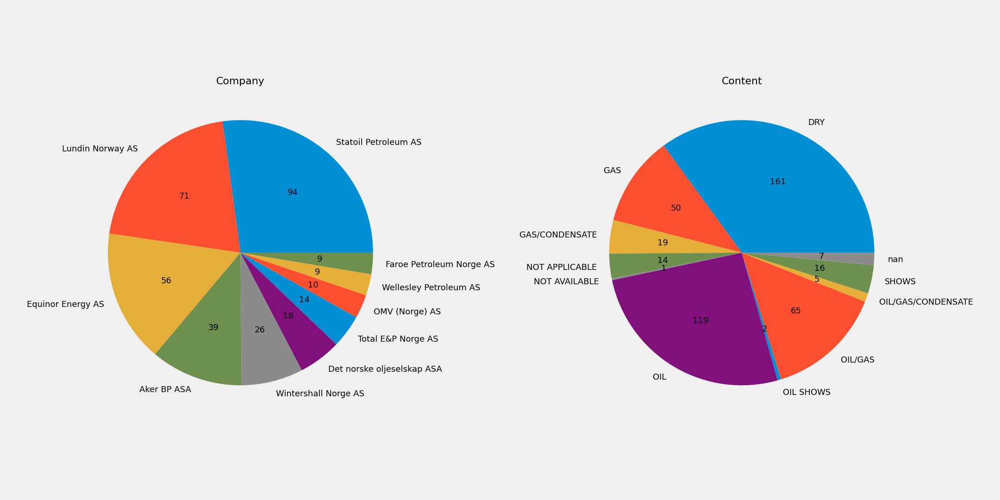
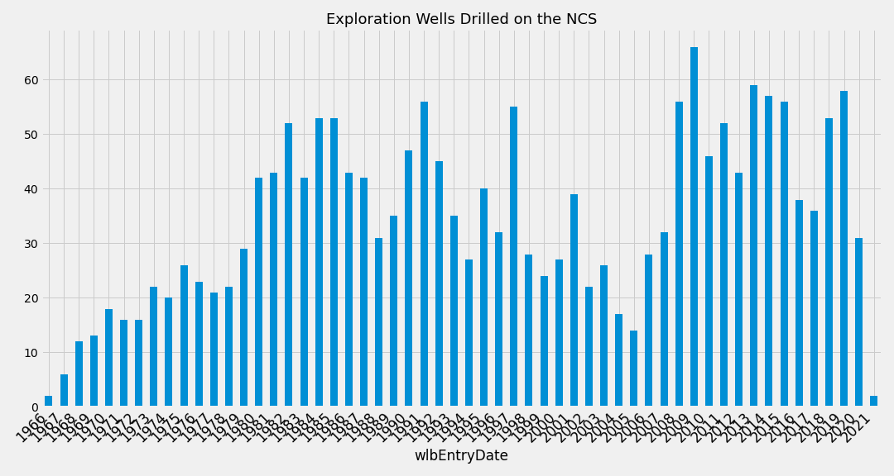
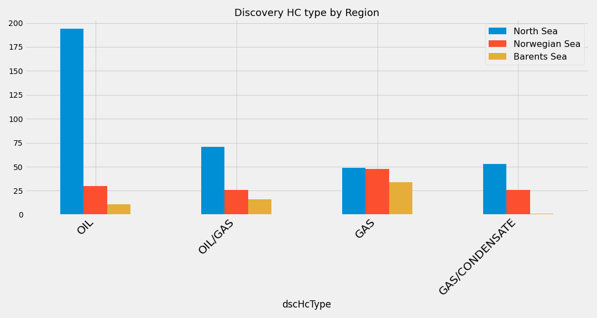

# Norwegian Petroleum Directorate (NPD)
The [NPD](https://npd.no/en) provides publically accessible data for export.  The data is organised into tabs;
* Wellbore
* Licence
* BAA
* Field
* Discovery
* Company
* Survey
* Facility
* TUF
* Stratigraphy

This repository provides a visual summary of the table data.

# Exploration Summary
Drilling results from current year, previous year, last 10 years and all years

### Previous Year Drilling Results

### Previous 10 Years

### Exploration Drilling by Numbers

### Hydrocarbon Results

