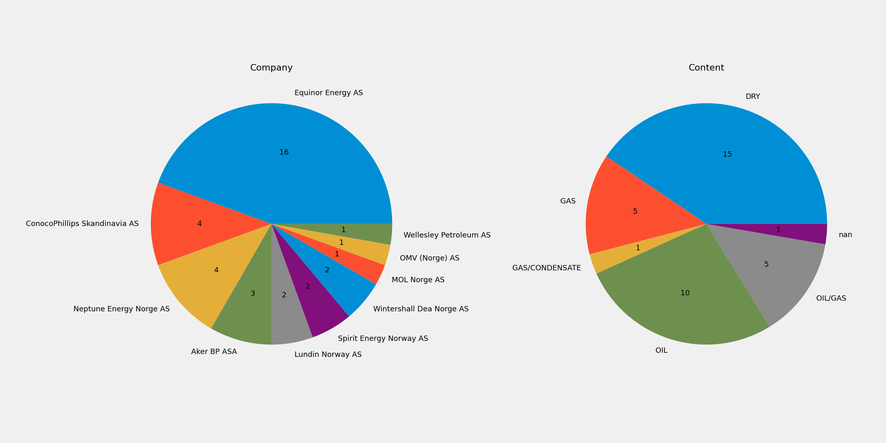
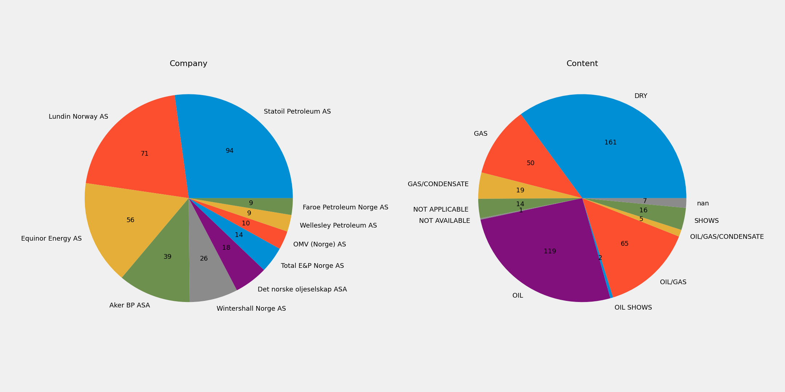
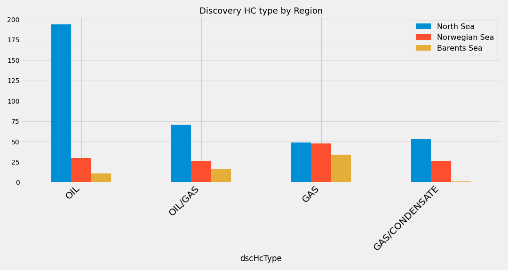

# Norwegian Petroleum Directorate (NPD)
The [NPD](https://npd.no/en) provides publically accessible data for export.  The data is organised into tabs;
* Wellbore (Exploration, Development)
* Licence (Overview, Licensees, Operators, Area, Phases, Transfers, Work, Register)
* BAA (Overview, Licensees, Area, Transfers, Operators)
* Field (Overview, Status, Operators, Owners, Licensees, Production, Reserves, Volumes, Investments, Description)
* Discovery (Overview, Resources, Description)
* Company (All, Reserves)
* Survey
* Facility
* TUF
* Stratigraphy (Overview, Wellbores, Cores)

This repository provides a visual summary of the table data.

# Exploration Summary
The following visuals provide an overview of the drilling results and activities from the Norwegian Continental Shelf (NCS) thoughout the years.

### Previous Year Drilling Results
Chart show all the Operating Companies that drilled wells on the NCS in the previous year.  Chart does not show Licensees or Licence drilled.


### Previous 10 Years
Chart shows all the Operating Companies that drilled wells on the NCS in the previous 10 years.  Note that companies (eg Statoil -> Equinor) have changed name.


### Exploration Drilling by Numbers by years
Chart shows the number of wells drilled on the NCS by year


### Hydrocarbon Results
Chart shows the hydrocarbon results in fluid-type for each discovery well


---

## Welcome to GitHub Pages

You can use the [editor on GitHub](https://github.com/ABDunbar/NPD-Visualisation/edit/gh-pages/index.md) to maintain and preview the content for your website in Markdown files.

Whenever you commit to this repository, GitHub Pages will run [Jekyll](https://jekyllrb.com/) to rebuild the pages in your site, from the content in your Markdown files.

### Markdown

Markdown is a lightweight and easy-to-use syntax for styling your writing. It includes conventions for

```markdown
Syntax highlighted code block

# Header 1
## Header 2
### Header 3

- Bulleted
- List

1. Numbered
2. List

**Bold** and _Italic_ and `Code` text

[Link](url) and 
```

For more details see [GitHub Flavored Markdown](https://guides.github.com/features/mastering-markdown/).

### Jekyll Themes

Your Pages site will use the layout and styles from the Jekyll theme you have selected in your [repository settings](https://github.com/ABDunbar/NPD-Visualisation/settings). The name of this theme is saved in the Jekyll `_config.yml` configuration file.

### Support or Contact

Having trouble with Pages? Check out our [documentation](https://docs.github.com/categories/github-pages-basics/) or [contact support](https://support.github.com/contact) and we’ll help you sort it out.
